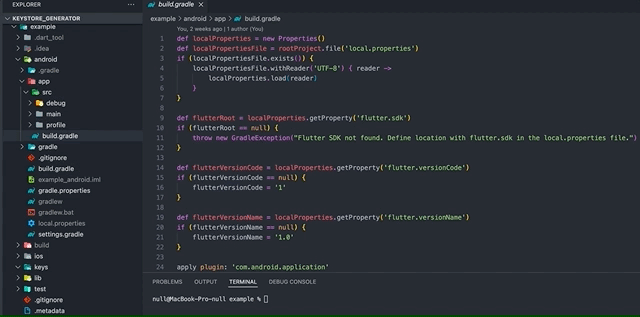

This package helps you to sign your android app. It generates the `keys/KEYSTORE_NAME.keystore`, `android/key.properties` and edits the `android/app/build.gradle`.

## Features

Use these flags:
- -a (required) to set alias
- -p (required) to set a password
- -y to overwrite the .keystore if keys/KEYSTORE_NAME.keystore has already been created

## Getting started

Add package in `dev_dependencies`
```yaml
dev_dependencies:
  keystore_generator:
```

## Usage

Command `flutter pub run keystore_generator -a test -p test123 -y` creates a keystore with 'test' alias, 'test123' password and overwrites existing keystore.




## Additional information

Package modifies files exactly as recommended [here](https://docs.flutter.dev/deployment/android#create-an-upload-keystore)
